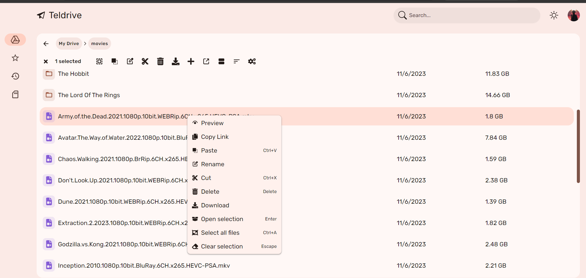

<h1 align="center"> Telegram Drive</h1>
 
<details open="open">
  <summary>Table of Contents</summary>
  <ol>
    <li>
      <a href="#how-to-make-your-own">How to make your own</a>
      <ul>
        <li><a href="prerequisites">Prerequisites</a></li>
        <li><a href="#deploy-using-docker-compose">Deploy using docker-compose</a></li>
      </ul>
    </li>
    <li><a href="#setting-up-things">Setting up things</a></li>
    <ul>
      <li><a href="#mandatory-vars">Mandatory Vars</a></li>
      <li><a href="#optional-vars">Optional Vars</a></li>
    </ul>
  </ol>
</details>

## Demo




### Deploy using docker-compose
First clone the repository
```sh
git clone https://github.com/divyam234/teldrive
cd teldrive
```
now create the `.env` file with your variables. and start your container:
**If you are deploying without https replace nginx.conf with  nginx_nossl.conf
in docker-compose.yml.It should look like this**
```yml
volumes:
      - ./nginx_nossl.conf:/etc/nginx/conf.d/default.conf
```
```sh
docker compose up -d
```

## Setting up things

If you're locally hosting, create a file named `.env` in the root directory and add all the variables there.
An example of `.env` file:

```sh
API_ID=452525
API_HASH=esx576f8738x883f3sfzx83
MULTI_TOKEN1=55838383:yourfirstmulticlientbottokenhere
MULTI_TOKEN2=55838383:yoursecondmulticlientbottokenhere
MULTI_TOKEN3=55838383:yourthirdmulticlientbottokenhere
BIN_CHANNEL=-100
PORT=8080
FQDN=yourserverhost
HTTPS=1
DATABASE_URL='postgres_url'
JWT_SECRET=
DATABASE_NAME=drive
```
### Mandatory Vars
Before running the bot, you will need to set up the following mandatory variables:

- `API_ID` : This is the API ID for your Telegram account, which can be obtained from my.telegram.org.

- `API_HASH` : This is the API hash for your Telegram account, which can also be obtained from my.telegram.org.

- `JWT_SECRET` : Used for signing jwt tokens

- `DATABASE_URL` : Connection String obtained from Postgres DB (you can use Neon db as free alternative fro postgres)

- `BIN_CHANNEL` :  This is the channel ID for the log channel where the bot will forward media messages and store these files to make the generated direct links work. To obtain a channel ID, create a new telegram channel (public or private), post something in the channel, forward the message to [@missrose_bot](https://telegram.dog/MissRose_bot) and **reply the forwarded message** with the /id command. Copy the forwarded channel ID and paste it into the this field.

### Optional Vars
In addition to the mandatory variables, you can also set the following optional variables:

- `WORKERS` : This sets the maximum number of concurrent workers for handling incoming updates. The default value is 3.

- `PORT` : This sets the port that your webapp will listen to. The default value is 8080.

- `HTTPS` : Enable HTTPS support on nginx

- `USE_SESSION_FILE` : Use session files for client(s) rather than storing the pyrogram sqlite database in the memory

### For making use of Multi-Client support

> **Note**
> What it multi-client feature and what it does? <br>
> This feature shares the Telegram API requests between other bots to avoid getting floodwaited (A kind of rate limiting that Telegram does in the backend to avoid flooding their servers) and to make the server handle more requests. <br>

To enable multi-client, generate new bot tokens and add it as your environmental variables with the following key names. 

`MULTI_TOKEN1`: Add your first bot token here.

`MULTI_TOKEN2`: Add your second bot token here.

you may also add as many as bots you want. (max limit is not tested yet)
`MULTI_TOKEN3`, `MULTI_TOKEN4`, etc.

> **Warning**
> Don't forget to add all these bots to the `BIN_CHANNEL` for the proper functioning

## FAQ

- How long the links will remain valid or is there any expiration time for the links generated by the bot?
> The links will will be valid as longs as your bot is alive and you haven't deleted the log channel.

## Contributing

Feel free to contribute to this project if you have any further ideas


